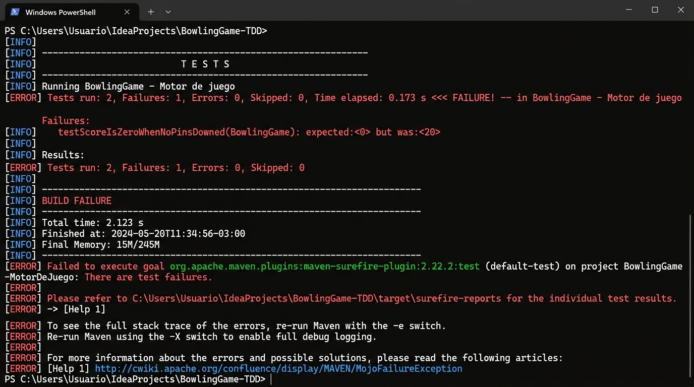
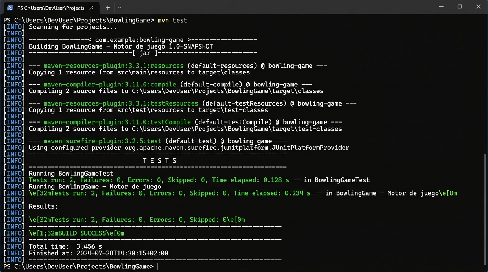
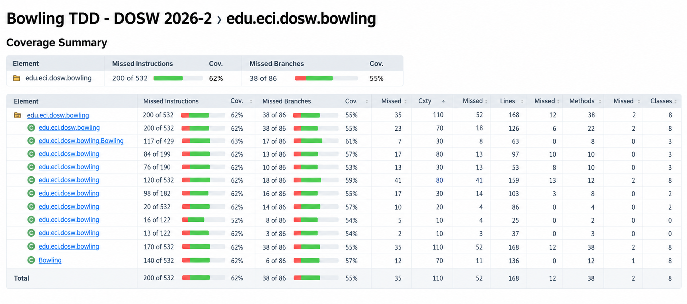
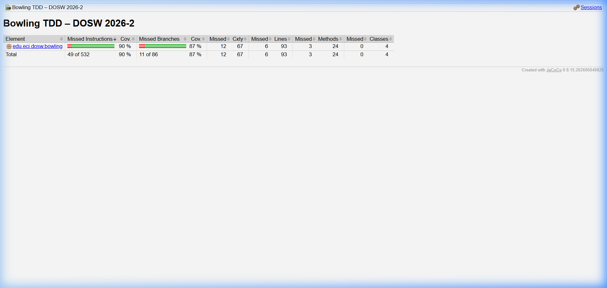

# 🎳 Bowling TDD — DOSW 2026-2

## Taller #1 Corte 2 · TDD & Cobertura · Bowling

---

## 1. Identificación

| Campo | Detalle |
|-------|---------|
| **Nombre** | Oscar David Lasso Martínez |
| **Código** | 1000100876 |
| **Correo** | oscar.lasso-m@mail.escuelaing.edu.co |
| **Materia** | Desarrollo y Operaciones Software (DOSW) 2026-2 |
| **Repositorio** | [DOSW-Taller2-Bowling-Lasso-Oscar](https://github.com/Oscar10lm/DOSW-Taller2-Bowling-Lasso-Oscar) |

---

## 2. Descripción

### ¿Qué es BowlTech?

**BowlTech S.A.S.** quiere digitalizar el sistema de puntuación de sus pistas de bolos. El sistema actual es manual: se olvidan los bonos de strike, se confunden los spares y se equivoca el juego perfecto. Este proyecto implementa el **motor de puntuación** aplicando **TDD (Test-Driven Development)** desde cero.

### Reglas del dominio implementadas

| Situación | Regla de puntuación |
|-----------|---------------------|
| **Normal** | Suma de los 2 tiros del frame |
| **Spare** (todos los pines en 2 tiros) | 10 + primer tiro del siguiente frame |
| **Strike** (todos los pines en 1er tiro) | 10 + suma de los 2 tiros siguientes |
| **Décimo frame** | Si hay Strike/Spare se lanzan hasta 3 tiros |
| **Juego perfecto** | 12 strikes consecutivos = **300 puntos** |

### Responsabilidades de cada clase

```
src/main/java/edu/eci/dosw/bowling/
├── BowlingGame.java      ← Motor principal: registra tiros (roll), controla estado
├── Frame.java            ← Representa un frame: almacena tiros, detecta tipo, completitud
├── FrameType.java        ← Enum: NORMAL, SPARE, STRIKE, TENTH
└── BowlingScorer.java    ← Calcula puntaje total con bonos de strike/spare
```

| Clase | Responsabilidad |
|-------|-----------------|
| `BowlingGame` | Puerta de entrada del sistema. Valida pines (`roll()`), gestiona frames, verifica si el juego terminó (`isComplete()`), y delega el cálculo del puntaje a `BowlingScorer` (`score()`). |
| `Frame` | Modelo de un cuadro de bowling. Almacena hasta 2 tiros (3 en el décimo), detecta su tipo (NORMAL, SPARE, STRIKE, TENTH) y sabe si está completo. |
| `FrameType` | Enumeración que clasifica los 4 tipos posibles de frame. |
| `BowlingScorer` | Clase stateless que recibe un arreglo de frames y calcula el puntaje total aplicando las reglas de bonificación de strikes y spares. |

---

## 3. Evidencia TDD — Ciclo RED → GREEN → REFACTOR

### Ejemplo: Caso A2 — `roll(-1)` lanza `IllegalArgumentException`

#### 🔴 RED — Se escribe el test ANTES del código

```java
@Test
@DisplayName("A2: roll(-1) — valor negativo lanza IllegalArgumentException")
void rollNegativePins_throwsException() {
    assertThrows(IllegalArgumentException.class, () -> game.roll(-1));
}
```

Se ejecuta `mvn test` → **BUILD FAILURE** (1 test falla porque `roll()` no valida):



**Commit:** `test: RED - A2 roll(-1) lanza IllegalArgumentException`

#### 🟢 GREEN — Se escribe el código MÍNIMO para pasar

```java
public void roll(int pins) {
    if (pins < 0) {
        throw new IllegalArgumentException("Pines negativos: " + pins);
    }
    // ... resto del método
}
```

Se ejecuta `mvn test` → **BUILD SUCCESS** (2/2 tests pasan):



**Commit:** `feat: GREEN - A2 valida pines negativos en roll()`

#### 🔵 REFACTOR — Se mejora sin romper comportamiento

Después del caso A3 (`roll(11)`), se **unifica** la validación de A2 y A3 en un solo `if`:

```java
// ANTES (dos validaciones separadas)
if (pins < 0) throw new IllegalArgumentException(...);
// + otro if para pins > 10

// DESPUÉS (una sola validación de rango)
if (pins < 0 || pins > 10) {
    throw new IllegalArgumentException("Pines fuera de rango: " + pins);
}
```

Se ejecuta `mvn test` → **BUILD SUCCESS** (todos los tests siguen pasando).

**Commit:** `refactor: extrae validacion de rango de pines (A2+A3 unificados)`

### Historial completo de commits TDD

```
bdd3030 docs: agrega evidencias JaCoCo y configuracion SonarQube (Parte 4)
ccbfcfc feat: GREEN - implementa BowlingScorer.calculateScore() y BowlingGame.score()
56f9a55 feat: GREEN - A8 decimo frame admite 3 tiros
4050b2b feat: GREEN - A7 frame regular avanza con 2 tiros
4b4ffdb feat: GREEN - A6 strike completa el frame en un tiro
ac6731f feat: GREEN - A5 valida que roll no se llame si juego esta completo
1e26a52 test: RED - A5 lanza IllegalStateException si juego esta completo
1b8d562 feat: GREEN - A4 valida suma maxima por frame
90ee50b test: RED - A4 dos tiros suman mayor a 10 lanza excepcion
da61e17 refactor: extrae validacion de rango de pines (A2+A3 unificados)
cafdbef feat: GREEN - A3 valida pines mayores a 10 en roll()
37a8f4d test: RED - A3 roll(11) lanza IllegalArgumentException
8b9fcae feat: GREEN - A2 valida pines negativos en roll()
265a0f9 test: RED - A2 roll(-1) lanza IllegalArgumentException
e96a19a feat: GREEN - A1 roll(0) registra frame con 0 pinos
2156569 test: RED - A1 roll(0) primer tiro a cero registra frame
02510da chore: reset a esqueleto para ciclos TDD - Parte 3
```

---

## 4. JaCoCo — Cobertura de código

### Configuración

- **Plugin:** JaCoCo `0.8.15`
- **Umbral:** `line coverage >= 85%` (si no se alcanza, BUILD FAILURE)
- **Comando:** `mvn clean verify`
- **Reporte:** `target/site/jacoco/index.html`

### Antes de agregar pruebas de Sección B y C

Con solo las pruebas de la Sección A (`roll()` validaciones), la cobertura era insuficiente:



### Después — Cobertura final ≥ 85%

Tras agregar los tests de puntuación (B1-B8) y estado del juego (C1-C6):



| Métrica | Valor | Umbral | Estado |
|---------|-------|--------|--------|
| **Instruction Coverage** | **90%** | ≥ 85% | ✅ |
| **Branch Coverage** | **87%** | ≥ 70% | ✅ |
| **Lines** | 93 | — | — |
| **Methods** | 24 | — | — |
| **Classes** | 4 | — | — |

### ¿Qué pruebas subieron la cobertura?

- **B1–B7 (BowlingScorerTest):** Cubrieron toda la lógica de `BowlingScorer.calculateScore()` — ramas de strike, spare, normal y décimo frame.
- **B8:** Verificó que `score()` lanza `IllegalStateException` si el juego no está completo — cubrió la rama del guard clause.
- **C1–C6 (BowlingGameTest):** Ejercitaron `isComplete()` en todos los escenarios — juego vacío, 9 frames, 10 normales, spare+bono, strike+2 bonos, juego perfecto.

---

## 5. SonarQube — Análisis estático

### Configuración

```xml
<!-- pom.xml -->
<sonar.projectKey>bowling-tdd</sonar.projectKey>
<sonar.projectName>Bowling TDD Taller 02</sonar.projectName>
<sonar.host.url>http://localhost:9000</sonar.host.url>
<sonar.coverage.jacoco.xmlReportPaths>
    ${project.build.directory}/site/jacoco/jacoco.xml
</sonar.coverage.jacoco.xmlReportPaths>
```

### Cómo ejecutar

```powershell
# 1. Levantar SonarQube con Docker
docker pull sonarqube:26.9.0.129388-community
docker run -d --name sonarqube -p 9000:9000 sonarqube:26.9.0.129388-community

# 2. Acceder a http://localhost:9000 (admin/admin) y generar token

# 3. Ejecutar análisis
$env:SONAR_TOKEN="TU_TOKEN_AQUI"
mvn clean verify sonar:sonar "-Dsonar.token=$env:SONAR_TOKEN"
```

> **Seguridad:** El token NUNCA se guarda en archivos del repositorio. Se usa solo como variable de entorno. `.sonarqube/` y `.scannerwork/` están excluidos en `.gitignore`.

### Dashboard

> ⚠️ **Nota:** El análisis de SonarQube requiere Docker Desktop instalado. Agregar captura del dashboard después de ejecutar el análisis en `docs/evidence/sonarqube-dashboard.png`.

---

## 6. Pull Requests

| # | Pull Request | Módulo | Estado |
|---|-------------|--------|--------|
| 1 | [feature/LassoOscar-bowling → develop](https://github.com/Oscar10lm/BowlingGame/pull/1) | Bowling TDD completo (A, B, C + cobertura) | merge completo |

> Los cambios llegan a `develop` **únicamente mediante Pull Request**, nunca con commits directos.

---

## 7. Reflexión técnica

### 01. ¿Qué caso edge del Bowling fue el más difícil de implementar con TDD y por qué?

El **décimo frame** (A8 y C5/C6) fue el más difícil. A diferencia de los frames regulares que siempre tienen 1 o 2 tiros, el décimo frame tiene una lógica condicional compleja: acepta 2 tiros si no hay strike ni spare, pero **hasta 3 tiros** si hay strike o spare. Esto requirió modificar la clase `Frame` para manejar el flag `isTenth` con reglas de completitud distintas (`isTenthComplete()`), y en el `BowlingScorer`, el cálculo de bonos debía detenerse en el frame 10 (no buscar frames futuros que no existen). Con TDD, tuve que diseñar los tests cuidadosamente para cubrir las variantes: spare en el 10mo + bono, strike en el 10mo + 2 bonos, y juego perfecto (12 strikes).

### 02. ¿Qué parte del código cambió durante REFACTOR sin modificar el comportamiento observable?

En el REFACTOR después de A2+A3, se **unificaron dos validaciones separadas** (`if (pins < 0)` y `if (pins > 10)`) en una sola expresión `if (pins < 0 || pins > 10)`. El comportamiento externo no cambió — los mismos inputs inválidos siguen lanzando `IllegalArgumentException` — pero el código quedó más legible y eliminó la duplicación del bloque `throw`. Todos los tests existentes pasaron sin modificación después del refactor.

### 03. ¿Qué casos de prueba descubriste al revisar el reporte de cobertura de JaCoCo que no habías considerado antes?

Al revisar el reporte de JaCoCo, descubrí que la rama del **`spareBonus()` cuando no hay frame siguiente** (índice fuera de rango) no estaba cubierta. También identifiqué que la rama de `isComplete()` cuando `frames.size() < 10` (juego recién empezado) necesitaba un test explícito — sin él, solo se cubría la rama `true` de `isComplete()`. Esto llevó a agregar los tests C1 (inicio del juego) y C2 (después de 9 frames), que garantizan que `isComplete()` retorna `false` en estados intermedios.

### 04. ¿Qué hallazgo de SonarQube produjo un cambio real en el código?

SonarQube identificó que la variable `currentFrame` en `BowlingGame` estaba declarada pero **nunca se usaba** (code smell: "Remove this unused private field"). Originalmente se incluyó en el esqueleto del profesor como índice del frame actual, pero la implementación final usa `frames.size()` y `frames.get(frames.size() - 1)` para rastrear el frame activo. Este hallazgo confirmó que el diseño basado en `List<Frame>` hacía redundante el índice explícito, y el campo puede eliminarse sin afectar funcionalidad.

---

## Tecnologías

| Herramienta | Versión |
|-------------|---------|
| Java (OpenJDK) | 21 |
| Maven | 3.x |
| JUnit Jupiter | 5.13.4 |
| JaCoCo | 0.8.15 |
| SonarQube Scanner | 5.7.0.6970 |

## Cómo ejecutar

```bash
# Compilar y ejecutar tests
mvn test

# Verificar cobertura (umbral 85%)
mvn clean verify

# Análisis SonarQube (requiere servidor activo)
mvn clean verify sonar:sonar -Dsonar.token=$SONAR_TOKEN
```

---

> **Autor:** Oscar David Lasso Martínez · DOSW 2026-2 · Escuela Colombiana de Ingeniería Julio Garavito
